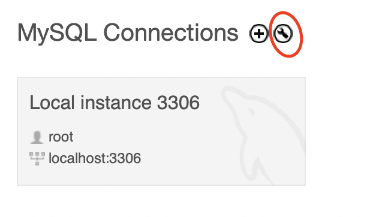
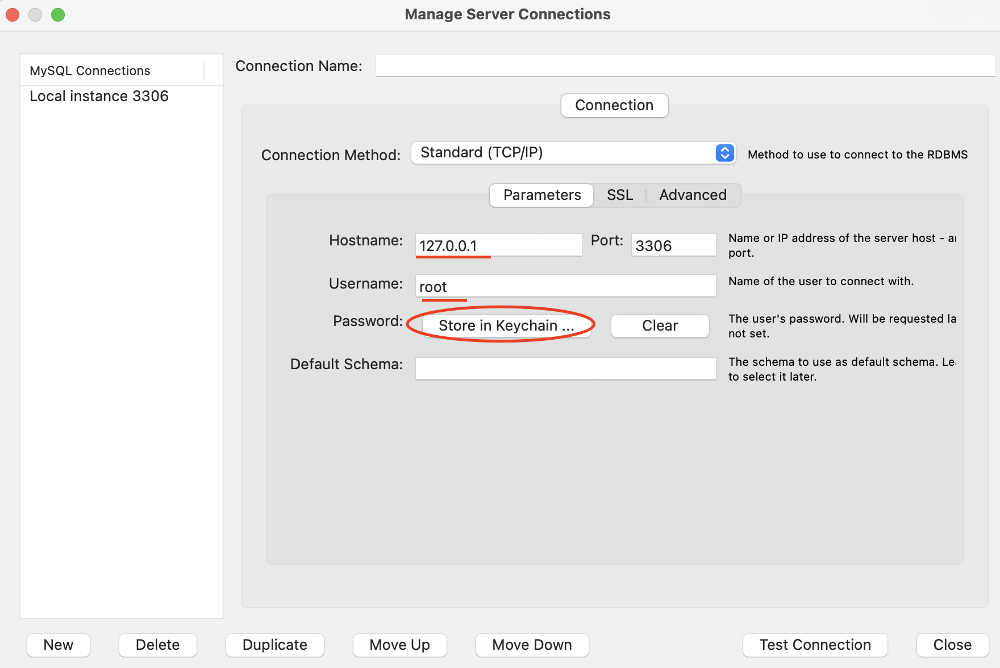

# Group Members:

- Shraawani Lattoo
- Gabe Milburn
- Ava Collier
- Jazmin Green

# Building Database

1. Run build.sql to construct the database, triggers, and procedures.

2. Run fill.sql to fill the database with test data.

# Setting up to connect to Python script. 

1. Check where your local workbench connection is located and ensure a password has been set. 

    1. In MySQLWorkbench you can do this by selecting the wrench icon above your local instance of the opening screen.
    

    2. You can then view the setting info on your local connection. The user, hostname, and password are needed to run this project. If a password has not been set, you can set one by selecting "Store in keychain..." and selecting a password.
    

2. Ensure the user and hostname connection information in manager.py match where your local connection is stored. This can be viewed in the first function: validate_credentials, is surrounded by a large comment block. If they do not match, these need o be updated to where your local instance is stored.

# Running the program

1. To run the program you must run the manager.py file in python. You can do this by navigating to the folder where this project is stored, and running the command `python3 manager.py` in a terminal. Other python files contain supporting functions that are used in this program.

2. Note, you will be prompted to enter your stored password. This must be set and entered correctly to access the database.

3. You will them be prompted to enter a UserID. This will determine your privileges when interacting with the rest of the program.

# Other Notes

1. This program was built for and exected using Python version 3.13.7.

2. This program was built using mysql-connector-python version 9.5.0 - other versions have not been tested for compatibility. 

